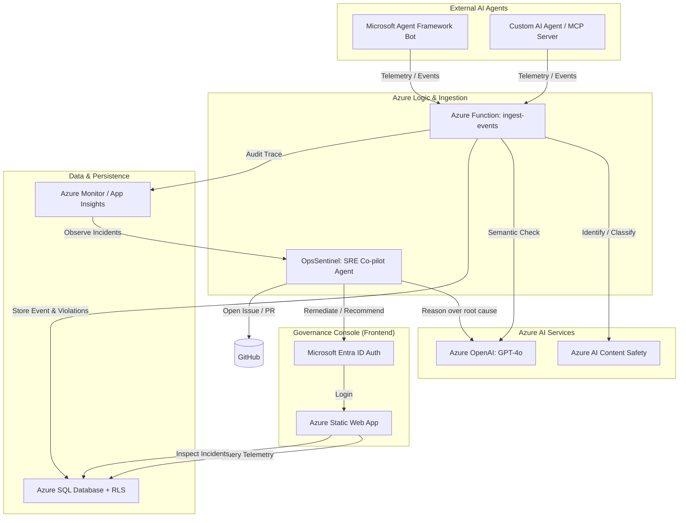

# Architecture

> Deep-dive into AgentOps system design, data model, and security boundaries.

---

## Table of Contents

- [System Diagram](#system-diagram)
- [Frontend Architecture](#frontend-architecture)
- [Database Schema](#database-schema)
- [Edge Functions](#edge-functions)
- [Policy Engine](#policy-engine)
- [Authentication & Authorization](#authentication--authorization)
- [Audit Trail](#audit-trail)

---

## System Diagram (Azure-Native)

---

## Frontend Architecture

- **Entry point:** `src/main.tsx` → `src/App.tsx`
- **Providers (outermost → innermost):** QueryClientProvider → TooltipProvider → BrowserRouter → AuthProvider → WorkspaceProvider
- **Protected routes** are wrapped in `<ProtectedRoute>` which redirects unauthenticated users to `/login`.
- **Layout:** `<DashboardLayout>` renders `<AppSidebar>` + `<TopBar>` + `<Outlet>` for nested page routes.
- **Custom hooks:**
  - `useAuditLog()` — wraps `supabase.rpc("log_audit", ...)` for fire-and-forget audit entries.
- **Design system:** All colors use HSL-based CSS custom properties defined in `src/index.css` and consumed via Tailwind's semantic tokens (e.g., `bg-primary`, `text-muted-foreground`).

---

## Database Schema

### Enums

| Enum | Values |
|---|---|
| `agent_environment` | `dev`, `stage`, `prod` |
| `app_role` | `admin`, `moderator`, `user` |
| `event_severity` | `info`, `warning`, `error`, `critical` |
| `incident_severity` | `low`, `medium`, `high`, `critical` |
| `incident_status` | `open`, `investigating`, `mitigated`, `closed` |
| `workspace_role` | `owner`, `admin`, `observer` |

### Key Tables

- **workspaces** — Tenant isolation boundary.
- **workspace_members** — Links users to workspaces with a role.
- **agents** — Registered AI agents scoped to a workspace.
- **policies** — Governance rule sets (JSON `rule_config`) scoped to a workspace.
- **agent_policies** — Many-to-many join between agents and policies.
- **events** — Ingested telemetry records from agents.
- **policy_violations** — Violations detected during event ingestion.
- **incidents** — Investigation records with lifecycle status.
- **incident_comments** — Comments and status-change records on incidents.
- **incident_events** — Links events to incidents.
- **incident_agents** — Links agents to incidents.
- **audit_logs** — Append-only action log (insert-only via `log_audit()` RPC).
- **api_keys** — Hashed API keys for external agent authentication.
- **profiles** — User display names and avatars (auto-created on signup via trigger).
- **user_roles** — Application-level roles (separate from workspace roles).

### Triggers

- **`handle_new_user()`** — Creates a profile row when a new auth user is created.
- **`handle_new_user_workspace()`** — Creates a default workspace and owner membership for new users.
- **`update_updated_at_column()`** — Auto-updates `updated_at` on modified rows.

---

## Edge Functions

### `ingest-events`

- **Purpose:** External API for AI agents to report activity.
- **Auth:** `x-api-key` header → SHA-256 hashed → matched against `api_keys` table via `validate_api_key()` RPC.
- **Flow:** Validate key → verify agent ownership → insert event → evaluate policies → insert violations → write audit log.
- **Uses service role key** to bypass RLS (the caller is an external agent, not a browser user).

---

## Policy Engine

Three built-in rule checkers:

| Rule Type | Description |
|---|---|
| `pii_detection` | Scans event payload for email, SSN, phone, credit card patterns. |
| `max_response_length` | Flags responses exceeding a character limit. |
| `blocked_topics` | Flags payloads containing forbidden keywords. |

Rules are defined in the policy's `rule_config` JSON and evaluated in the `ingest-events` edge function. New rule types can be added by implementing a checker function and registering it in the `RULE_CHECKERS` map.

---

## Authentication & Authorization

- **Authentication:** Supabase Auth with email/password. JWT-based sessions managed by `@supabase/supabase-js`.
- **Authorization layers:**
  1. **RLS policies** on every table — most use `is_workspace_member()` for SELECT and `get_workspace_role()` for mutations.
  2. **Workspace roles** (`owner`, `admin`, `observer`) — Owners and Admins can create/update/delete resources; Observers have read-only access.
  3. **Application roles** (`user_roles` table) — For global permissions (e.g., platform admin). Checked via `has_role()` security-definer function.

---

## Audit Trail

- **Implementation:** `log_audit()` PostgreSQL function (security definer) inserts into `audit_logs`.
- **Client-side:** `useAuditLog()` hook calls the RPC. Failures are caught and logged to console without blocking user actions.
- **Actions tracked:** `create`, `read`, `update`, `delete`, `transition`, `ingest`.
- **Read-audit logging:** Sensitive views (Dashboard, Incident Detail, Policy Detail, Event Detail) log `read` actions on mount.
- **audit_logs table:** Insert-only from the client perspective (no UPDATE/DELETE RLS policies). The `log_audit()` function uses `auth.uid()` to capture the current user.
